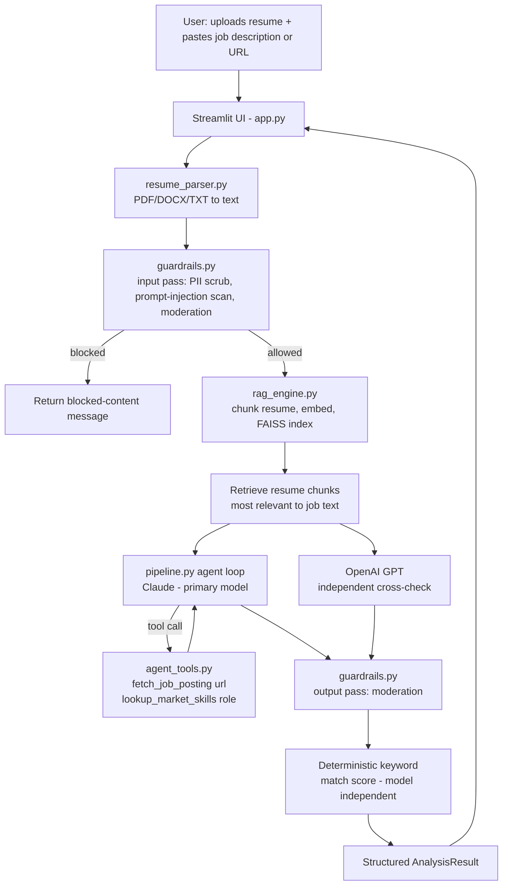

# Architecture

## System diagram

## Component responsibilities

| Component | File | Responsibility |
|---|---|---|
| UI | `app.py` | Streamlit front end: uploads, mode toggle, renders results |
| Parsing | `src/resume_parser.py` | Extracts and cleans text from PDF/DOCX/TXT, chunks it for RAG |
| Guardrails | `src/guardrails.py` | PII scrubbing, prompt-injection detection, content moderation (input + output) |
| RAG | `src/rag_engine.py` | Chunk embedding (OpenAI `text-embedding-3-small`, or a deterministic mock embedder), FAISS similarity search |
| Agent tools | `src/agent_tools.py` | `fetch_job_posting(url)` and `lookup_market_skills(role)`, callable by Claude mid-reasoning |
| Orchestration | `src/pipeline.py` | Wires the above into one request/response cycle; owns the deterministic keyword-match scoring |
| LLM clients | `src/llm_clients.py` | Thin wrappers around the Anthropic and OpenAI SDKs, with a "mock" mode for offline/no-key demos |

## Why two LLMs

Claude acts as the primary reasoning + tool-calling agent (it decides whether
to fetch a job URL or look up market-demand skills before answering).
OpenAI's GPT model is used as an independent second opinion on the same
retrieved context, so the user can see where the two models agree and
where they diverge, rather than trusting a single model's judgment.

## Why a deterministic match score

The headline "match score" is computed from a fixed skill/keyword
vocabulary (`SKILL_VOCAB` in `pipeline.py`), not asked of an LLM. This
makes the core metric auditable and reproducible — the same resume/job
pair always produces the same score, and it can be unit tested without
any API calls (see `evaluation/evaluate.py`). The LLMs are used for the
qualitative coaching narrative, where their judgment adds real value.

## Safety design

- **Input guardrails** run before anything is embedded or sent to an
  LLM: PII is masked, and text resembling a prompt-injection attempt
  (e.g. "ignore previous instructions") is flagged. Injected text is
  never blocked outright — it's treated as inert data by construction,
  because the system prompt instructs the model to treat resume/job
  content strictly as data, not instructions, and user-supplied content
  is only ever passed inside the `user` role, never concatenated into
  `system`.
- **Output guardrails** run on both models' responses before display,
  using OpenAI's moderation endpoint in live mode (with a local
  keyword fallback in mock mode).
- **Mock mode** exists specifically so the guardrail and RAG logic can
  be evaluated and graded without spending API credits or requiring
  network access.
